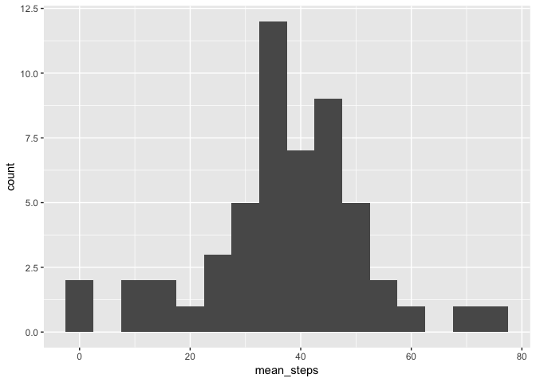
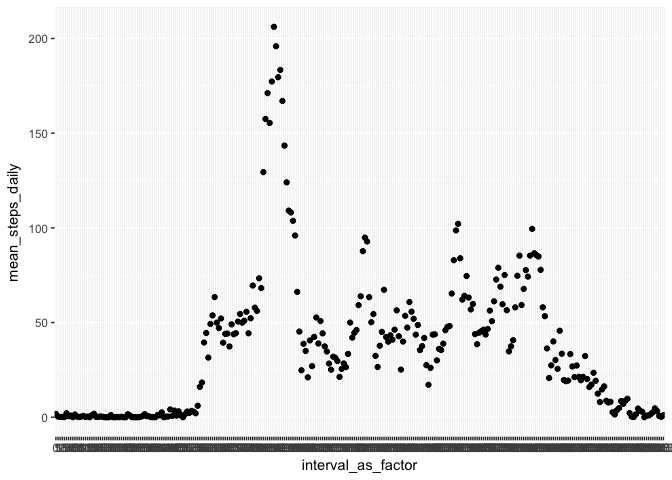
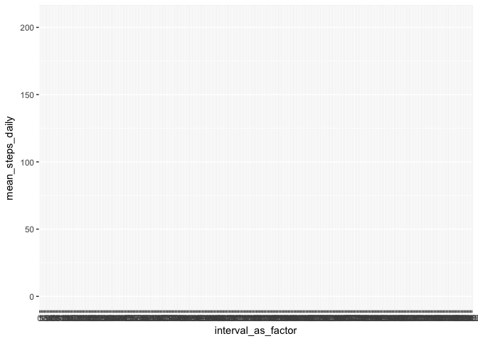
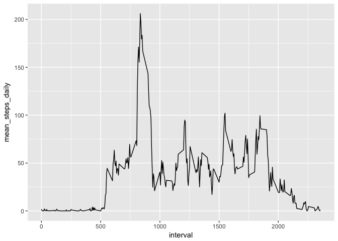
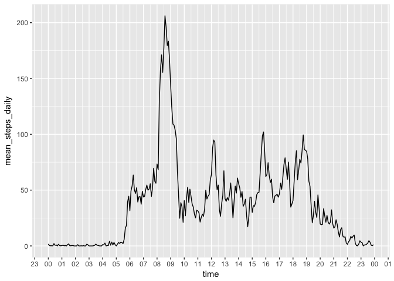
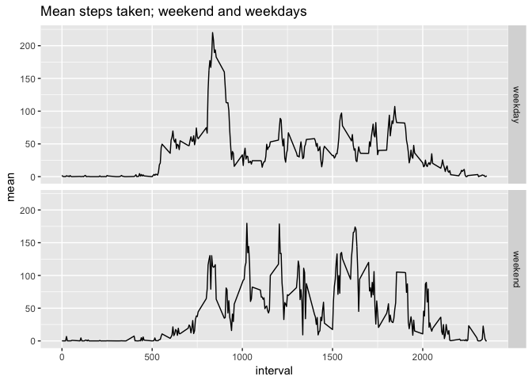

# Reproducible Research: Peer Assessment 1


# Overview
It is now possible to collect a large amount of data about personal movement using activity monitoring devices such as a Fitbit, Nike Fuelband, or Jawbone Up. These type of devices are part of the “quantified self” movement – a group of enthusiasts who take measurements about themselves regularly to improve their health, to find patterns in their behavior, or because they are tech geeks. But these data remain under-utilized both because the raw data are hard to obtain and there is a lack of statistical methods and software for processing and interpreting the data.

This assignment makes use of data from a personal activity monitoring device. This device collects data at 5 minute intervals through out the day. The data consists of two months of data from an anonymous individual collected during the months of October and November, 2012 and include the number of steps taken in 5 minute intervals each day.

The submission has the following  
1. Code for reading in the dataset and/or processing the data
2. Histogram of the total number of steps taken each day
3. Mean and median number of steps taken each day
4. Time series plot of the average number of steps taken
5. The 5-minute interval that, on average, contains the maximum number of steps
6. Code to describe and show a strategy for imputing missing data
7. Histogram of the total number of steps taken each day after missing values are imputed
8. Panel plot comparing the average number of steps taken per 5-minute interval across weekdays and weekends

## Loading and pre-processing the data


```r
library(dplyr)
```

```
## 
## Attaching package: 'dplyr'
```

```
## The following objects are masked from 'package:stats':
## 
##     filter, lag
```

```
## The following objects are masked from 'package:base':
## 
##     intersect, setdiff, setequal, union
```

```r
library(ggplot2)
library(lubridate)
```

```
## 
## Attaching package: 'lubridate'
```

```
## The following object is masked from 'package:base':
## 
##     date
```

```r
df <- read.csv("data/activity.csv")
head(df,100)
```

```
##     steps       date interval
## 1      NA 2012-10-01        0
## 2      NA 2012-10-01        5
## 3      NA 2012-10-01       10
## 4      NA 2012-10-01       15
## 5      NA 2012-10-01       20
## 6      NA 2012-10-01       25
## 7      NA 2012-10-01       30
## 8      NA 2012-10-01       35
## 9      NA 2012-10-01       40
## 10     NA 2012-10-01       45
## 11     NA 2012-10-01       50
## 12     NA 2012-10-01       55
## 13     NA 2012-10-01      100
## 14     NA 2012-10-01      105
## 15     NA 2012-10-01      110
## 16     NA 2012-10-01      115
## 17     NA 2012-10-01      120
## 18     NA 2012-10-01      125
## 19     NA 2012-10-01      130
## 20     NA 2012-10-01      135
## 21     NA 2012-10-01      140
## 22     NA 2012-10-01      145
## 23     NA 2012-10-01      150
## 24     NA 2012-10-01      155
## 25     NA 2012-10-01      200
## 26     NA 2012-10-01      205
## 27     NA 2012-10-01      210
## 28     NA 2012-10-01      215
## 29     NA 2012-10-01      220
## 30     NA 2012-10-01      225
## 31     NA 2012-10-01      230
## 32     NA 2012-10-01      235
## 33     NA 2012-10-01      240
## 34     NA 2012-10-01      245
## 35     NA 2012-10-01      250
## 36     NA 2012-10-01      255
## 37     NA 2012-10-01      300
## 38     NA 2012-10-01      305
## 39     NA 2012-10-01      310
## 40     NA 2012-10-01      315
## 41     NA 2012-10-01      320
## 42     NA 2012-10-01      325
## 43     NA 2012-10-01      330
## 44     NA 2012-10-01      335
## 45     NA 2012-10-01      340
## 46     NA 2012-10-01      345
## 47     NA 2012-10-01      350
## 48     NA 2012-10-01      355
## 49     NA 2012-10-01      400
## 50     NA 2012-10-01      405
## 51     NA 2012-10-01      410
## 52     NA 2012-10-01      415
## 53     NA 2012-10-01      420
## 54     NA 2012-10-01      425
## 55     NA 2012-10-01      430
## 56     NA 2012-10-01      435
## 57     NA 2012-10-01      440
## 58     NA 2012-10-01      445
## 59     NA 2012-10-01      450
## 60     NA 2012-10-01      455
## 61     NA 2012-10-01      500
## 62     NA 2012-10-01      505
## 63     NA 2012-10-01      510
## 64     NA 2012-10-01      515
## 65     NA 2012-10-01      520
## 66     NA 2012-10-01      525
## 67     NA 2012-10-01      530
## 68     NA 2012-10-01      535
## 69     NA 2012-10-01      540
## 70     NA 2012-10-01      545
## 71     NA 2012-10-01      550
## 72     NA 2012-10-01      555
## 73     NA 2012-10-01      600
## 74     NA 2012-10-01      605
## 75     NA 2012-10-01      610
## 76     NA 2012-10-01      615
## 77     NA 2012-10-01      620
## 78     NA 2012-10-01      625
## 79     NA 2012-10-01      630
## 80     NA 2012-10-01      635
## 81     NA 2012-10-01      640
## 82     NA 2012-10-01      645
## 83     NA 2012-10-01      650
## 84     NA 2012-10-01      655
## 85     NA 2012-10-01      700
## 86     NA 2012-10-01      705
## 87     NA 2012-10-01      710
## 88     NA 2012-10-01      715
## 89     NA 2012-10-01      720
## 90     NA 2012-10-01      725
## 91     NA 2012-10-01      730
## 92     NA 2012-10-01      735
## 93     NA 2012-10-01      740
## 94     NA 2012-10-01      745
## 95     NA 2012-10-01      750
## 96     NA 2012-10-01      755
## 97     NA 2012-10-01      800
## 98     NA 2012-10-01      805
## 99     NA 2012-10-01      810
## 100    NA 2012-10-01      815
```

```r
summary(df)
```

```
##      steps                date          interval     
##  Min.   :  0.00   2012-10-01:  288   Min.   :   0.0  
##  1st Qu.:  0.00   2012-10-02:  288   1st Qu.: 588.8  
##  Median :  0.00   2012-10-03:  288   Median :1177.5  
##  Mean   : 37.38   2012-10-04:  288   Mean   :1177.5  
##  3rd Qu.: 12.00   2012-10-05:  288   3rd Qu.:1766.2  
##  Max.   :806.00   2012-10-06:  288   Max.   :2355.0  
##  NA's   :2304     (Other)   :15840
```

```r
df <- df %>%
        mutate(duration = duration(interval, "minutes"))
```

## Mean total number of steps taken per day
- NA's will be ignored


```r
df_summary <- df %>% 
        filter(!is.na(steps)) %>%
        group_by(date) %>%
        summarise(mean_steps = mean(steps))

head(df_summary)
```

```
## # A tibble: 6 × 2
##         date mean_steps
##       <fctr>      <dbl>
## 1 2012-10-02    0.43750
## 2 2012-10-03   39.41667
## 3 2012-10-04   42.06944
## 4 2012-10-05   46.15972
## 5 2012-10-06   53.54167
## 6 2012-10-07   38.24653
```

```r
g <- ggplot(df_summary, aes(x=mean_steps)) + geom_histogram(binwidth = 5)
print(g)
```

<!-- -->

```r
mean_original <- round(mean(df_summary$mean_steps), digits=1)
print(paste("The mean is ", mean_original))
```

```
## [1] "The mean is  37.4"
```

```r
median_original <- round(median(df_summary$mean_steps),digits = 1)            
print(paste("The median is ", median_original))
```

```
## [1] "The median is  37.4"
```

## Average daily activity pattern
- Make a time series plot (i.e. 𝚝𝚢𝚙𝚎 = "𝚕") of the 5-minute interval (x-axis) and the average number of steps taken, averaged across all days (y-axis)
- Which 5-minute interval, on average across all the days in the dataset, contains the maximum number of steps?


```r
head(df)
```

```
##   steps       date interval            duration
## 1    NA 2012-10-01        0                  0s
## 2    NA 2012-10-01        5   300s (~5 minutes)
## 3    NA 2012-10-01       10  600s (~10 minutes)
## 4    NA 2012-10-01       15  900s (~15 minutes)
## 5    NA 2012-10-01       20 1200s (~20 minutes)
## 6    NA 2012-10-01       25 1500s (~25 minutes)
```

```r
df_daily_pattern <- df %>%
        filter(!is.na(steps)) %>%
        mutate(interval_as_factor = as.factor(interval)) %>%
        group_by(interval_as_factor) %>%
        summarise(mean_steps_daily = mean(steps)) 

head(df_daily_pattern)
```

```
## # A tibble: 6 × 2
##   interval_as_factor mean_steps_daily
##               <fctr>            <dbl>
## 1                  0        1.7169811
## 2                  5        0.3396226
## 3                 10        0.1320755
## 4                 15        0.1509434
## 5                 20        0.0754717
## 6                 25        2.0943396
```

```r
qplot(interval_as_factor, mean_steps_daily, data = df_daily_pattern)
```

<!-- -->

```r
g <- ggplot(df_daily_pattern ,aes(x=interval_as_factor,y = mean_steps_daily)) + geom_line()
print(g)
```

```
## geom_path: Each group consists of only one observation. Do you need to
## adjust the group aesthetic?
```

<!-- -->

```r
head(df)
```

```
##   steps       date interval            duration
## 1    NA 2012-10-01        0                  0s
## 2    NA 2012-10-01        5   300s (~5 minutes)
## 3    NA 2012-10-01       10  600s (~10 minutes)
## 4    NA 2012-10-01       15  900s (~15 minutes)
## 5    NA 2012-10-01       20 1200s (~20 minutes)
## 6    NA 2012-10-01       25 1500s (~25 minutes)
```

```r
df_daily_pattern2 <- df %>%
        filter(!is.na(steps)) %>%
        group_by(interval) %>%
        summarise(mean_steps_daily = mean(steps)) 
qplot(interval, mean_steps_daily, data = df_daily_pattern2, geom = "line")
```

<!-- -->

```r
df_daily_pattern_3 <- df %>%
        filter(!is.na(steps)) %>%
        group_by(interval) %>%
        summarise(mean_steps_daily = mean(steps))

df_daily_pattern_3$time <- ymd("20170101")
minute(df_daily_pattern_3$time) <- seq(0,287*5,by=5)
head(df_daily_pattern_3)
```

```
## # A tibble: 6 × 3
##   interval mean_steps_daily      time
##      <int>            <dbl>    <dttm>
## 1        0        1.7169811 <POSIXlt>
## 2        5        0.3396226 <POSIXlt>
## 3       10        0.1320755 <POSIXlt>
## 4       15        0.1509434 <POSIXlt>
## 5       20        0.0754717 <POSIXlt>
## 6       25        2.0943396 <POSIXlt>
```

```r
df1 <- tbl_df(df_daily_pattern_3)
qplot(time, mean_steps_daily, data = df1, geom="line") + 
        scale_x_datetime(date_breaks = "1 hour", date_labels = "%H")
```

<!-- -->

```r
max_interval <- df1[which.max(df1$mean_steps_daily),]$interval
print(paste("The max interval is ", max_interval))
```

```
## [1] "The max interval is  835"
```

## Inpute missing values

1. Calculate and report the total number of missing values in the dataset (i.e. the total number of rows with 𝙽𝙰s)
2. Devise a strategy for filling in all of the missing values in the dataset. The strategy does not need to be sophisticated. For example, you could use the mean/median for that day, or the mean for that 5-minute interval, etc.
3. Create a new dataset that is equal to the original dataset but with the missing data filled in.
4. Make a histogram of the total number of steps taken each day and Calculate and report the mean and median total number of steps taken per day. Do these values differ from the estimates from the first part of the assignment? What is the impact of imputing missing data on the estimates of the total daily number of steps?


```r
missing <- sum(is.na(df$steps))
print(paste("There are", missing, "NA's in the data."))
```

```
## [1] "There are 2304 NA's in the data."
```

<2>
To inpute, I will use the mean for the 5-minute interval, as calculated in the df_daily_pattern


```r
df_inputed <- df
df_missing <- df_inputed[is.na(df_inputed$steps),]
head(df_missing)
```

```
##   steps       date interval            duration
## 1    NA 2012-10-01        0                  0s
## 2    NA 2012-10-01        5   300s (~5 minutes)
## 3    NA 2012-10-01       10  600s (~10 minutes)
## 4    NA 2012-10-01       15  900s (~15 minutes)
## 5    NA 2012-10-01       20 1200s (~20 minutes)
## 6    NA 2012-10-01       25 1500s (~25 minutes)
```

```r
df_missing$steps <- df_daily_pattern_3[match(df_missing$interval,df_daily_pattern_3$interval),]$mean_steps_daily
head(df_missing)
```

```
##       steps       date interval            duration
## 1 1.7169811 2012-10-01        0                  0s
## 2 0.3396226 2012-10-01        5   300s (~5 minutes)
## 3 0.1320755 2012-10-01       10  600s (~10 minutes)
## 4 0.1509434 2012-10-01       15  900s (~15 minutes)
## 5 0.0754717 2012-10-01       20 1200s (~20 minutes)
## 6 2.0943396 2012-10-01       25 1500s (~25 minutes)
```

```r
df_inputed[is.na(df_inputed$steps),]$steps <- df_missing$steps
head(df_inputed)
```

```
##       steps       date interval            duration
## 1 1.7169811 2012-10-01        0                  0s
## 2 0.3396226 2012-10-01        5   300s (~5 minutes)
## 3 0.1320755 2012-10-01       10  600s (~10 minutes)
## 4 0.1509434 2012-10-01       15  900s (~15 minutes)
## 5 0.0754717 2012-10-01       20 1200s (~20 minutes)
## 6 2.0943396 2012-10-01       25 1500s (~25 minutes)
```

```r
summary(df_inputed)
```

```
##      steps                date          interval     
##  Min.   :  0.00   2012-10-01:  288   Min.   :   0.0  
##  1st Qu.:  0.00   2012-10-02:  288   1st Qu.: 588.8  
##  Median :  0.00   2012-10-03:  288   Median :1177.5  
##  Mean   : 37.38   2012-10-04:  288   Mean   :1177.5  
##  3rd Qu.: 27.00   2012-10-05:  288   3rd Qu.:1766.2  
##  Max.   :806.00   2012-10-06:  288   Max.   :2355.0  
##                   (Other)   :15840                   
##     duration                    
##  Min.   :0s                     
##  1st Qu.:35325s (~9.81 hours)   
##  Median :70650s (~19.62 hours)  
##  Mean   :70650s (~19.62 hours)  
##  3rd Qu.:105975s (~1.23 days)   
##  Max.   :141300s (~1.64 days)   
## 
```

<4>
Make a histogram of the total number of steps taken each day and Calculate and report the mean and median total number of steps taken per day. Do these values differ from the estimates from the first part of the assignment? What is the impact of imputing missing data on the estimates of the total daily number of steps?

```r
df_daily_inputed <- df_inputed %>%
        group_by(date) %>%
        summarise(mean_steps_daily = mean(steps))
head(df_daily_inputed)
```

```
## # A tibble: 6 × 2
##         date mean_steps_daily
##       <fctr>            <dbl>
## 1 2012-10-01         37.38260
## 2 2012-10-02          0.43750
## 3 2012-10-03         39.41667
## 4 2012-10-04         42.06944
## 5 2012-10-05         46.15972
## 6 2012-10-06         53.54167
```

```r
summary(df_daily_inputed)
```

```
##          date    mean_steps_daily 
##  2012-10-01: 1   Min.   : 0.1424  
##  2012-10-02: 1   1st Qu.:34.0938  
##  2012-10-03: 1   Median :37.3826  
##  2012-10-04: 1   Mean   :37.3826  
##  2012-10-05: 1   3rd Qu.:44.4826  
##  2012-10-06: 1   Max.   :73.5903  
##  (Other)   :55
```

```r
mean_inputed <- mean(df_daily_inputed$mean_steps_daily)
median_inputed <- mean(df_daily_inputed$mean_steps_daily)

print(mean_inputed - mean(df_summary$mean_steps))
```

```
## [1] 0
```

```r
print(median_inputed - median(df_summary$mean_steps))
```

```
## [1] 0.004127358
```

## Are there differences in activity patterns between weekdays and weekends?

For this part the 𝚠𝚎𝚎𝚔𝚍𝚊𝚢𝚜() function may be of some help here. Use the dataset with the filled-in missing values for this part.

1. Create a new factor variable in the dataset with two levels – “weekday” and “weekend” indicating whether a given date is a weekday or weekend day.
2. Make a panel plot containing a time series plot (i.e. 𝚝𝚢𝚙𝚎 = "𝚕") of the 5-minute interval (x-axis) and the average number of steps taken, averaged across all weekday days or weekend days (y-axis). See the README file in the GitHub repository to see an example of what this plot should look like using simulated data.


```r
# use df_inputed
df_is_weekday <- df_inputed
df_is_weekday$date <- ymd(df_is_weekday$date)
df_is_weekday$wday <- wday(df_is_weekday$date)
df_is_weekday$is_weekday <- ifelse(df_is_weekday$wday==(0|6),"weekend","weekday")

df_by_weekend <- df_is_weekday %>%
        group_by(interval, is_weekday) %>%
        summarise(mean = mean(steps))
qplot(interval, mean, data = df_by_weekend, facets = is_weekday~.,geom="line",
      main="Mean steps taken; weekend and weekdays")
```

<!-- -->

# Check status
