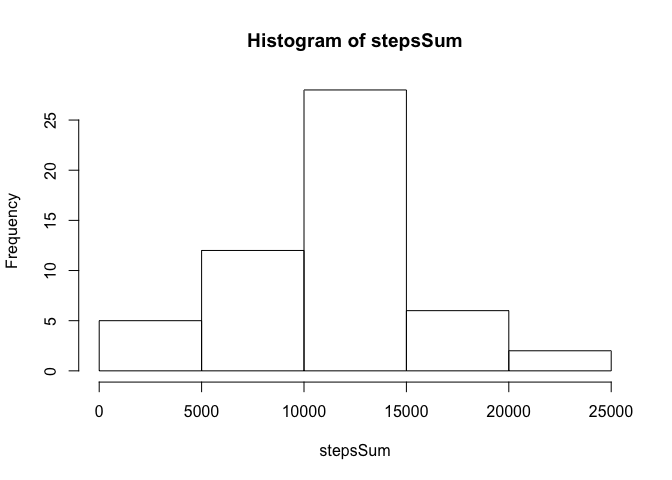
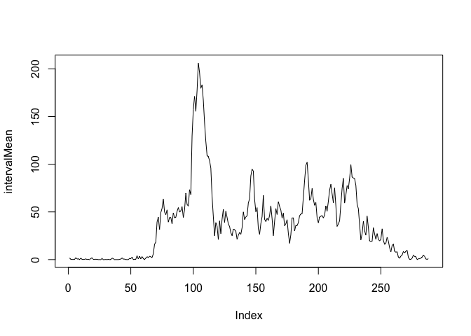
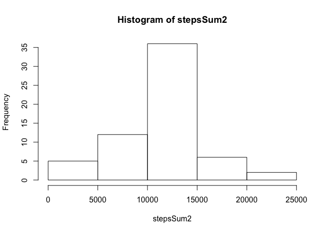

# Reproducible Research: Peer Assessment 1
### Setting Global options


## Loading and preprocessing the data

```r
setwd("/Users/shota/git/Coursera-Data-Science/RepData_PeerAssessment1/")
data <- read.csv("./data/activity.csv")
data$date <- as.Date(data$date, "%Y-%m-%d")
```

## What is mean total number of steps taken per day?

```r
stepsSum <- tapply(data$steps, data$date, sum)
hist(stepsSum)
```

 

The mean is

```r
mean(stepsSum, na.rm=T)
```

```
## [1] 10766.19
```

The median is 

```r
median(stepsSum, na.rm=T)
```

```
## [1] 10765
```

## What is the average daily activity pattern?

```r
intervalMean <- tapply(data$steps, data$interval, mean, na.rm=T)
plot(intervalMean, type="l")
```

 

The maximum is 

```r
max(intervalMean)
```

```
## [1] 206.1698
```

```r
which.max(intervalMean)
```

```
## 835 
## 104
```

Imputing missing values

```r
sum(is.na(data$steps))
```

```
## [1] 2304
```

```r
data2 <- data
for(i in seq_along(data$steps)){
        if(is.na(data2$steps[[i]])){
                a <- as.character(data2$interval[[i]])
                data2$steps[[i]] <- intervalMean[a]
        }
}
```

A histogram for the dataframe with missing values inputted

```r
sum(is.na(data2$steps))
```

```
## [1] 0
```

```r
head(data2)
```

```
##       steps       date interval
## 1 1.7169811 2012-10-01        0
## 2 0.3396226 2012-10-01        5
## 3 0.1320755 2012-10-01       10
## 4 0.1509434 2012-10-01       15
## 5 0.0754717 2012-10-01       20
## 6 2.0943396 2012-10-01       25
```

```r
stepsSum2 <- tapply(data2$steps, data2$date, sum)
hist(stepsSum2)
```

 


The mean is

```r
mean(stepsSum2, na.rm=T)
```

```
## [1] 10766.19
```

The median is 

```r
median(stepsSum2, na.rm=T)
```

```
## [1] 10766.19
```

The difference in the mean

```r
mean(stepsSum, na.rm=T) - mean(stepsSum2, na.rm=T)
```

```
## [1] 0
```

The difference in the median

```r
median(stepsSum, na.rm=T) - median(stepsSum2, na.rm=T)
```

```
## [1] -1.188679
```

## Are there differences in activity patterns between weekdays and weekends?

